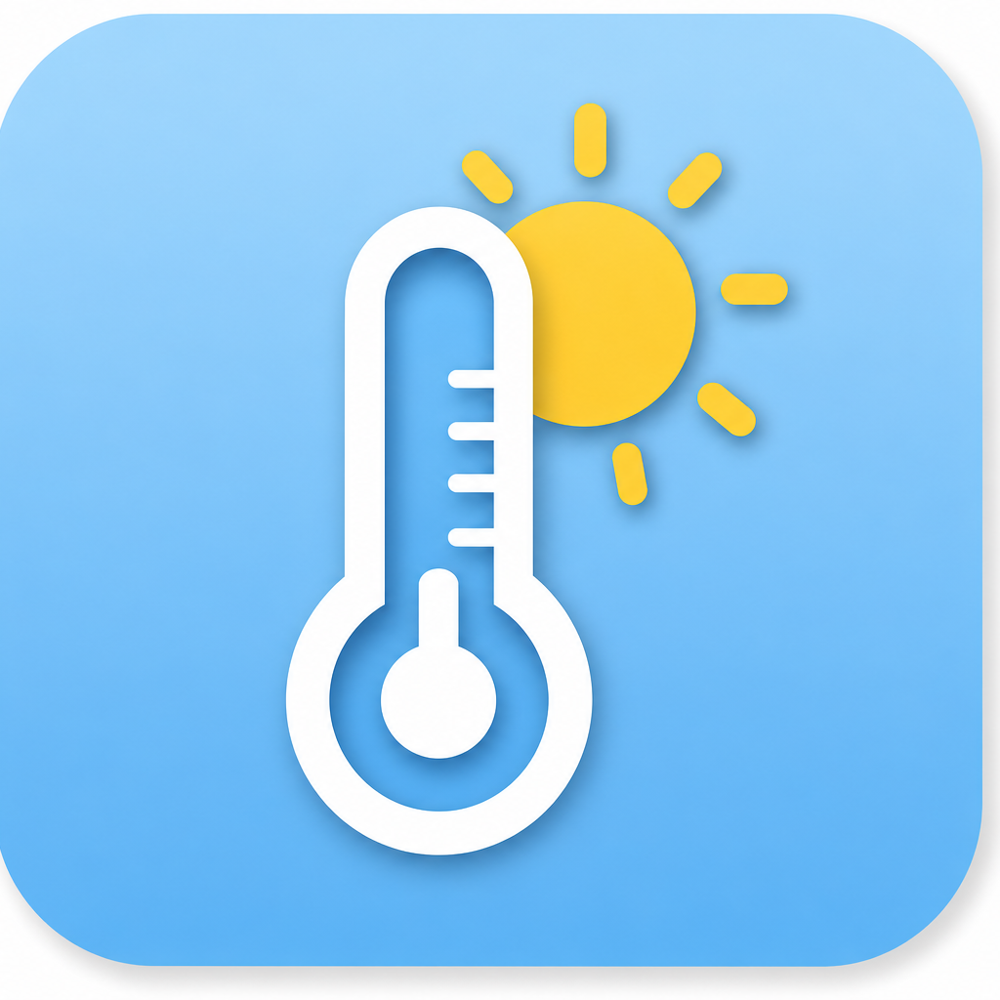
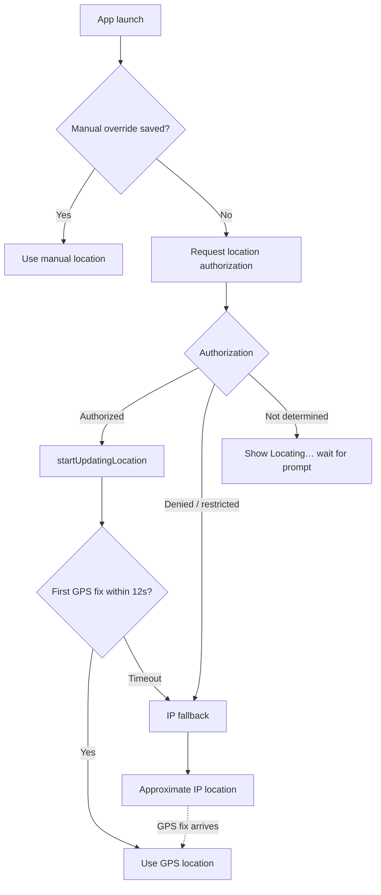

# WeatherBar

A lightweight macOS menu bar app that shows the current temperature in Celsius and Fahrenheit (e.g. `25°C / 77°F`) based on your location.

[](LICENSE)
[](https://github.com/NextStepGuru/mac-os-weather-temp/actions/workflows/ci.yml)
[](https://www.apple.com/macos/)
[](https://swift.org)
[](https://github.com/NextStepGuru/mac-os-weather-temp/releases)
[-blue)](https://developer.apple.com/documentation/apple-silicon)
[](CONTRIBUTING.md)

<p align="center">
  
</p>

<!-- Add a menu bar screenshot: save as docs/screenshot.png -->
<!-- <p align="center"></p> -->

## Features

- **Menu bar temperature** — dual Celsius/Fahrenheit display (e.g. `25°C / 77°F`)
- **Location dropdown** — city/state, local time with timezone, and last-updated timestamp
- **GPS tracking** — CoreLocation with ~3 km distance filter; re-fetches when you move
- **Manual location** — override with any place name via **Settings…** (persisted across launches)
- **IP fallback** — approximate city-level location when GPS is denied, labeled `Approx (IP)`
- **Resilient updates** — keeps the last valid temperature when a weather fetch fails
- **Auto-refresh** — updates every 10 minutes; **Refresh now** in the menu
- **Automatic updates** — checks GitHub Releases daily and installs signed, notarized builds when a newer version is available; use **Check for Updates…** any time for a manual check
- **Login autostart** — enabled by default on first launch; toggle via **Open at Login**
- **Log viewer** — built-in diagnostics via **View Logs**

## Requirements

- macOS 13 (Ventura) or later on **Apple Silicon or Intel** (universal binary: native `arm64` and `x86_64`)
- Swift 6+ (Xcode or Command Line Tools)
- Internet access for weather and geocoding data

## Install

### Download a release

Official builds from [GitHub Releases](https://github.com/NextStepGuru/mac-os-weather-temp/releases) are signed with a Developer ID certificate and notarized by Apple. Download the ZIP, unzip, and move `WeatherBar.app` to `/Applications` — it should open without a Gatekeeper warning.

```bash
open /Applications/WeatherBar.app
```

On first launch, macOS will prompt for **Location Services** permission. Allow access so the app can determine your coordinates.

### Build from source

```bash
git clone https://github.com/NextStepGuru/mac-os-weather-temp.git
cd mac-os-weather-temp
chmod +x scripts/build_app.sh
./scripts/build_app.sh
```

This compiles a **universal release binary** (`arm64` + `x86_64`), assembles `WeatherBar.app`, and ad-hoc signs it.

Verify architectures after building:

```bash
lipo -archs WeatherBar.app/Contents/MacOS/WeatherBar
# x86_64 arm64
```

### Recommended install location

For reliable login autostart, copy the app to `/Applications`:

```bash
cp -R WeatherBar.app /Applications/
open /Applications/WeatherBar.app
```

### Run without installing

```bash
open ./WeatherBar.app
```

If Gatekeeper blocks a locally built app (ad-hoc signed), right-click the app → **Open**, or allow it in **System Settings → Privacy & Security**.

## Usage

Click the temperature in the menu bar to open the dropdown:

| Menu item | Description |
|-----------|-------------|
| Status line | City, local time, timezone, update status |
| **Refresh now** | Fetch weather immediately (`⌘R`) |
| **View Logs** | Open the in-app log viewer |
| **Check for Updates…** | Manually check GitHub Releases for a newer build |
| **Update available (vX) — Install** | Appears when an update is ready; installs the release ZIP |
| **Automatic Updates** | Toggle daily background update checks and silent installs |
| **Settings…** | Set a manual location override (`⌘,`) |
| **Open at Login** | Toggle launch-at-login |
| **Quit** | Exit the app (`⌘Q`) |

## Automatic updates

When WeatherBar is installed as `WeatherBar.app` in a writable location (for example `/Applications`), it checks [GitHub Releases](https://github.com/NextStepGuru/mac-os-weather-temp/releases) once per day for a newer version. If one is available, it downloads the notarized release ZIP, replaces the installed app, and relaunches.

- **Automatic Updates** is enabled by default. Turn it off from the menu bar dropdown if you prefer to install updates manually.
- Use **Check for Updates…** any time to check immediately and choose whether to install.
- If WeatherBar is running from a dev build or another non-writable location, it will show **Update available** in the menu instead of installing silently.

## How location works

WeatherBar resolves your location using a priority chain:



**Priority:** Manual override > GPS (CoreLocation) > IP fallback (timed)

- **GPS** — most accurate; used when Location Services are allowed. The app waits up to **12 seconds** for a first fix before falling back to IP.
- **Manual** — set any place in **Settings…**; GPS updates are ignored while active.
- **IP fallback** — city-level approximation via [ipapi.co](https://ipapi.co/); only used when GPS is denied or no fix arrives within the grace period. Marked `Approx (IP)` in the dropdown. Any later GPS fix replaces the IP estimate.

### Resetting Location Services permission

If WeatherBar shows the wrong city or stays on `Approx (IP)` after granting permission, reset the app's location grant and reinstall:

```bash
# Quit WeatherBar first
tccutil reset Location com.weatherbar.app
./scripts/build_app.sh
cp -R WeatherBar.app /Applications/
open /Applications/WeatherBar.app
```

On relaunch, approve the Location Services prompt. If no prompt appears (common for menu bar apps), enable WeatherBar under **System Settings → Privacy & Security → Location Services**.

## Weather data and privacy

| Data | Source | When used |
|------|--------|-----------|
| Temperature | [NWS API](https://www.weather.gov/documentation/services-web-api) (primary), [Open-Meteo](https://open-meteo.com/) (fallback) | Every refresh |
| City / timezone | Apple reverse geocoding (CoreLocation) | GPS or manual location |
| Approximate location | [ipapi.co](https://ipapi.co/) | Only when GPS is denied or times out without a fix |

**Privacy notes:**

- Coordinates are sent only to the weather and geocoding services listed above.
- No accounts, analytics, or tracking.
- Manual location settings are stored locally in `UserDefaults`.
- IP lookup is attempted once per session when GPS is unavailable.

## Project structure

```
Package.swift
Sources/WeatherBar/
  main.swift
  AppDelegate.swift
  LocationProvider.swift
  WeatherService.swift
  GeocodingService.swift
  IPLocationService.swift
  SettingsStore.swift
  SettingsWindowController.swift
  AppLogger.swift
  LogViewerWindowController.swift
  LoginItemManager.swift
  UpdateService.swift
Resources/
  Info.plist
  AppIcon.icns
scripts/
  build_app.sh
  build_icon.sh
```

## Contributing

Contributions are welcome! See [CONTRIBUTING.md](CONTRIBUTING.md) for build instructions, code style, and PR guidelines.

Please read our [Code of Conduct](CODE_OF_CONDUCT.md) before participating.

## Security

To report a security vulnerability, see [SECURITY.md](SECURITY.md).

## License

This project is licensed under the [MIT License](LICENSE).

Copyright (c) 2026 NextStepGuru

## Acknowledgements

- [Open-Meteo](https://open-meteo.com/) — free weather API
- [National Weather Service](https://www.weather.gov/) — US weather data API
- [ipapi.co](https://ipapi.co/) — IP geolocation fallback
- Apple CoreLocation — GPS and reverse geocoding
